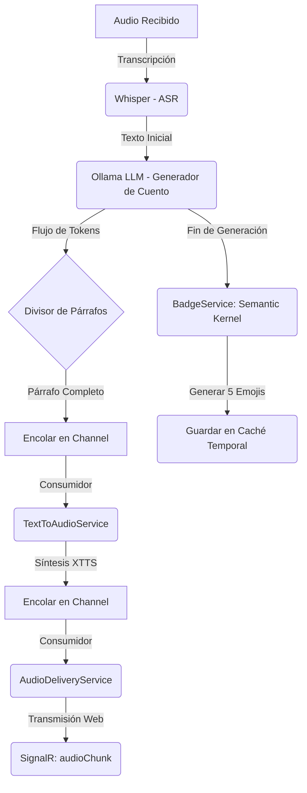

# Arquitectura del Sistema: StoryForge 📐

StoryForge está estructurado como una tubería (pipeline) asíncrona de procesamiento de voz a cuento en tiempo real, impulsada por **Semantic Kernel** y coordinada por trabajadores en segundo plano que se comunican mediante canales asíncronos y eventos en tiempo real.

---

## 🗺️ Mapa de Flujo de Datos

El sistema consta de dos flujos principales: la **generación en tiempo real** a partir de voz grabada y la **reproducción o gestión histórica** desde el Panel de Control (Backoffice).

### Flujo de Generación y Procesamiento de Cuentos (Real-time Pipeline)
```
┌──────────┐      Graba Audio y envia       ┌──────────────────────┐
│  Browser │ ──────────────────────────────▶│ POST /api/stories/new│
│ (Alpine) │◀───────────────────────────────└──────────────────────┘
└──────────┘  Eventos de estado y Audio chunks          │
      ▲                                                 │ Encola PipelineJob
      │                                                 ▼
      │   ┌────────────────────┐   Consume    ┌──────────────────────┐
      │   │  AudioDelivery-    │◀─────────────│   Channel-           │
      │   │  Service           │              │   <PipelineJob>      │
      │   └────────────────────┘              └──────────────────────┘
      │              ▲                                   │
      │              │ Consume AudioUnits                │ Procesa
      │   ┌────────────────────┐                         ▼
      │   │  TextToAudio-      │              ┌──────────────────────┐
      │   │  Service           │              │ StoryPipelineWorker  │
      │   └────────────────────┘              └──────────────────────┘
      │              ▲                                   │
      │              │ Consume TextUnits                 │ 1. Transcribe (Whisper)
      │   ┌────────────────────┐                         │ 2. Genera Cuento (Ollama)
      │   │  Generación        │◀────────────────────────┘ 3. Analiza Tono (Badge)
      │   │  (Ollama)          │                           4. Guarda en Caché Temporal
      │   └────────────────────┘
      │
      └────── SignalR (MessagePack) ─────── [Servidor StoryForge]
```

---

## 🔄 Tubería Concurrente de Procesamiento (System.Threading.Channels)

Para maximizar la eficiencia y reducir la latencia percibida por el usuario, el procesamiento se realiza de forma **paralela y concurrente** utilizando canales de memoria de alto rendimiento (`System.Threading.Channels`). El texto se divide a medida que el LLM lo genera y entra inmediatamente en el flujo de síntesis de voz, sin esperar a que el cuento completo esté redactado.



---

## 🛠️ Desglose de Componentes

El proyecto se divide limpiamente en servicios dedicados de backend y una interfaz rica de cliente SPA.

### Componentes de Servidor (`storyforge/`)

| Componente | Archivo / Carpeta | Función Principal |
|---|---|---|
| **Punto de Entrada** | [Program.cs](file:///c:/workspace/code/storyforge/storyforge/Program.cs) | Registro de DI, lectura de configuraciones, inicialización de DB y mapeo de endpoints mínimos de ASP.NET. |
| **Worker de Tubería** | [StoryPipelineWorker.cs](file:///c:/workspace/code/storyforge/storyforge/Services/StoryPipelineWorker.cs) | Servicio en segundo plano (`IHostedService`) que procesa secuencialmente los trabajos de la cola `Channel<PipelineJob>`. |
| **Orquestador** | [StoryPipelineRunner.cs](file:///c:/workspace/code/storyforge/storyforge/Services/StoryPipelineRunner.cs) | Ejecuta el flujo completo de un cuento: Whisper ASR → generación paralela Ollama + XTTS + SignalR → persistencia de metadatos. |
| **Servicio de Voz e Historia** | [VoiceStoryService.cs](file:///c:/workspace/code/storyforge/storyforge/Services/VoiceStoryService.cs) | Administra la comunicación de IA para ASR (Whisper via `IAudioToTextService`) y Chat (Ollama via `IChatCompletionService`). |
| **Traductor de Texto a Audio** | [TextToAudioService.cs](file:///c:/workspace/code/storyforge/storyforge/Services/TextToAudioService.cs) | Lee del `Channel<TextUnit>` de forma asíncrona y genera archivos de voz a través del servicio XTTS de Semantic Kernel. |
| **Distribuidor de Audio** | [AudioDeliveryService.cs](file:///c:/workspace/code/storyforge/storyforge/Services/AudioDeliveryService.cs) | Lee del `Channel<AudioUnit>` y transmite los fragmentos binarios en tiempo real al frontend a través de SignalR. |
| **Síntesis XTTS** | [XttsTextToAudioService.cs](file:///c:/workspace/code/storyforge/storyforge/Services/XttsTextToAudioService.cs) | Implementación personalizada de `ITextToAudioService` adaptada a la API local de XTTS-v2 con soporte para clonación de voz. |
| **Generador de Insignias** | [BadgeService.cs](file:///c:/workspace/code/storyforge/storyforge/Services/BadgeService.cs) | Ejecuta una función semántica de Semantic Kernel (`KernelFunctionFactory`) para clasificar el tono emocional de un cuento en exactamente 5 emojis. |
| **Repositorio SQLite** | [SqliteStoryRepository.cs](file:///c:/workspace/code/storyforge/storyforge/Services/SqliteStoryRepository.cs) | Maneja el acceso directo de lectura, escritura, actualización y eliminación de historias contra la base de datos persistente SQLite. |
| **Control de Caché** | [PersistenceService.cs](file:///c:/workspace/code/storyforge/storyforge/Services/PersistenceService.cs) | Gestiona la retención temporal en memoria (`IMemoryCache`) de cuentos generados hasta que el usuario decida guardarlos de forma permanente. |
| **Precalentador de Modelos**| [StoryWarmupService.cs](file:///c:/workspace/code/storyforge/storyforge/Services/StoryWarmupService.cs) | Asegura la inicialización controlada del motor de síntesis de voz, evitando bloqueos por peticiones concurrentes simultáneas de arranque en el servidor. |

### Componentes de Cliente (`storyforge/wwwroot/`)

- **Interfaz Principal (Lector/Grabadora)** (`wwwroot/index.html`):
  - Proporciona el grabador interactivo basado en Alpine.js.
  - Conecta con `StoryHub` mediante SignalR para reproducir progresivamente el cuento y los fragmentos de audio según van llegando.
- **Panel de Control (Backoffice)** (`wwwroot/backoffice/`):
  - `index.html`: Aplicación SPA de administración completa de historias.
  - `backoffice.css`: Hoja de estilos moderna y responsive (inspirada en Tailwind CSS) con tema oscuro, tarjetas con desenfoque de fondo (glassmorphism) y transiciones animadas premium.
  - Permite:
    1. **Listar cuentos**: Historial con títulos, fechas e insignias de emojis.
    2. **Lectura y visualización**: Vista inmersiva del contenido organizado por párrafos.
    3. **Edición**: Formulario directo para corregir títulos, emojis o el cuerpo de los párrafos guardados.
    4. **Eliminación**: Borrado físico e irreversible de la base de datos.
    5. **Re-reproducción de Voz (Dynamic Streaming Replay)**: Ejecuta una tubería de streaming dinámica para volver a generar los archivos de audio en tiempo real y transmitirlos por voz al navegador del cliente actual.

---

## ⚡ Decisiones Críticas de Diseño

1. **Abstracción a través de Semantic Kernel**:
   Todas las interacciones de inteligencia artificial (Whisper ASR, Ollama Chat y XTTS TTS) se realizan implementando o consumiendo las interfaces oficiales de Semantic Kernel (`IAudioToTextService`, `IChatCompletionService`, `ITextToAudioService`). Esto aisla el código de la infraestructura física subyacente.

2. **Canales Desacoplados (Channels)**:
   El uso de `System.Threading.Channels` permite que los componentes de generación y consumo corran a velocidades distintas de manera asíncrona y segura para subprocesos (thread-safe), optimizando el rendimiento de la CPU del servidor.

3. **Caché Efímera de Transición (IMemoryCache)**:
   Los cuentos recién generados no saturan la base de datos inmediatamente. Se almacenan temporalmente durante 10 minutos en la memoria caché del servidor. Solo cuando el usuario aprueba expresamente la historia y hace clic en "Guardar", esta se graba permanentemente en SQLite.

4. **Prevención de Inicialización Duplicada (Warmup Concurrency Lock)**:
   El servicio de voz (XTTS) puede ser lento en su primera carga (precalentamiento). Para prevenir múltiples peticiones concurrentes de inicialización (como recargas rápidas del navegador), el `StoryWarmupService` implementa una tarea única basada en un bloqueo thread-safe (`lock`). Cualquier petición subsiguiente de precalentamiento aguardará de forma segura a que la tarea en curso finalice con éxito en lugar de disparar inicializaciones redundantes.

5. **Re-reproducción en Streaming (Dynamic Replay)**:
   El endpoint `/api/stories/{id:guid}/replay` reutiliza de forma brillante los trabajadores de streaming asíncronos (`TextToAudioService` y `AudioDeliveryService`) inyectándoles texto leído directamente de la base de datos SQLite. Esto permite revivir la narración por voz con cero latencia y de forma idéntica a cuando se generó por primera vez.
