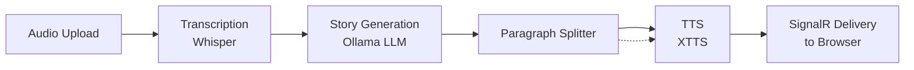

# Architecture

## Overview

StoryForge is a voice-to-story pipeline. The user records audio in the browser, which is sent to the server, transcribed to text, fed to an LLM to generate a story, converted paragraph-by-paragraph to audio via TTS, and streamed back to the browser in real time.

```
┌──────────┐     ┌──────────────┐     ┌──────────┐     ┌──────────┐     ┌──────────────┐
│  Browser  │ ──▶ │  /api/stories │ ──▶ │  Whisper  │ ──▶ │  Ollama   │ ──▶ │    XTTS      │
│ (Alpine)  │     │  /new (POST)  │     │  (ASR)    │     │  (LLM)    │     │   (TTS)      │
└──────────┘     └──────────────┘     └──────────┘     └──────────┘     └──────────────┘
      ▲                                                                         │
      │                           ┌──────────────────┐                          │
      └───────────────────────────│  SignalR Hub      │◀────────────────────────┘
                                  │  /storyHub        │
                                  └──────────────────┘
```

## Pipeline

The processing pipeline runs each job through three concurrent stages connected by `System.Threading.Channels`:



## Components

### Server (`storyforge/`)

| Component | File | Role |
|---|---|---|
| `Program.cs` | Entry point, DI, route & middleware registration | - |
| `StoryPipelineWorker` | Background service consuming `Channel<PipelineJob>` | - |
| `StoryPipelineRunner` | Orchestrates one job: transcribe → generate → TTS → deliver | - |
| `VoiceStoryService` | Transcribes audio & generates story text from LLM | - |
| `TextToAudioService` | Consumes `Channel<TextUnit>`, calls `ITextToAudioService` | - |
| `AudioDeliveryService` | Consumes `Channel<AudioUnit>`, sends audio via SignalR | - |
| `XttsTextToAudioService` | `ITextToAudioService` implementation for XTTS API | - |
| `StoryHub` | SignalR Hub (empty, used for client-server events) | - |

### Client (`storyforge/wwwroot/`)

| File | Role |
|---|---|
| `index.html` | SPA with Alpine.js, MediaRecorder, SignalR client |
| `audio-recorder.module.css` | CSS Module for recorder UI |

## Data Flow

1. **Record** — Browser captures audio via `MediaRecorder` (WebM).
2. **Upload** — `POST /api/stories/new` with `multipart/form-data` (audio + connectionId).
3. **Enqueue** — Server writes a `PipelineJob` to an unbounded `Channel<PipelineJob>`.
4. **Transcribe** — `StoryPipelineWorker` picks up the job, calls Whisper via Semantic Kernel `IAudioToTextService`.
5. **Generate** — LLM (Ollama via `IChatCompletionService`) streams the story. Paragraphs are split on `\n\n`.
6. **Parallel pipeline**: Each paragraph is written to `Channel<TextUnit>` and immediately picked up by `TextToAudioService` for TTS conversion.
7. **TTS** — `XttsTextToAudioService` calls the XTTS API, writes resulting audio to `Channel<AudioUnit>`.
8. **Deliver** — `AudioDeliveryService` reads audio chunks and sends them to the browser via SignalR (`audioChunk` event).
9. **Play** — Browser queues audio blobs and plays them sequentially.

## Key Design Decisions

- **Semantic Kernel first** — all AI interactions go through SK abstractions (`IAudioToTextService`, `IChatCompletionService`, `ITextToAudioService`), even when direct HTTP would be simpler. This was a learning-driven choice.
- **Channel-based pipeline** — `System.Threading.Channels` connect pipeline stages without shared state or blocking collections.
- **Per-paragraph TTS** — Each paragraph is independently sent to TTS as soon as it is generated, enabling near-real-time audio streaming.
- **No build tools** — Frontend uses Alpine.js via CDN and CSS Modules with native browser behavior.
