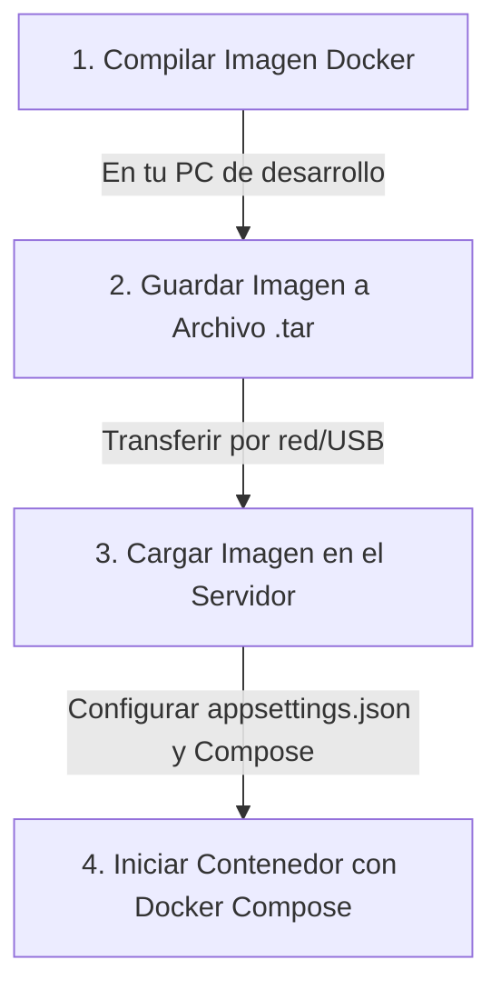

# Guía de Despliegue de StoryForge 🚀

Esta guía está diseñada para que cualquier persona, incluso sin experiencia previa en desarrollo o administración de sistemas, pueda compilar, transferir y desplegar la aplicación **StoryForge** en un entorno Docker en producción.

---

## 📋 Resumen del Proceso

Como el entorno donde compilas la aplicación (entorno de desarrollo) es distinto al entorno donde se ejecuta (entorno de producción/servidor), seguiremos estos **4 pasos sencillos**:



---

## 🛠️ Requisitos Previos

Antes de empezar, asegúrate de tener:
1. **En la máquina de compilación (tu PC de desarrollo):**
   * [Docker Desktop](https://www.docker.com/products/docker-desktop/) instalado y en ejecución.
2. **En la máquina de ejecución (el servidor/destino):**
   * Docker y Docker Compose instalados y funcionando.
   * Acceso para transferir archivos (a través de SSH/SCP, una unidad compartida en red, o un pendrive USB).
   * Los servicios de **Ollama**, **Faster-Whisper** y **XTTS** ya en ejecución y accesibles desde el servidor Docker.

---

## 🚶‍♂️ Paso a Paso Detallado

### Paso 1: Compilar la Imagen Docker (Máquina de Compilación)

La aplicación viene con un archivo llamado `Dockerfile` que le dice a Docker cómo compilar y empaquetar StoryForge automáticamente.

1. Abre una terminal (PowerShell en Windows, o la Terminal en macOS/Linux).
2. Dirígete a la **carpeta raíz** del proyecto (donde se encuentra el archivo `storyforge.sln` y la carpeta `storyforge`).
   > [!IMPORTANT]
   > Debes ejecutar el comando de compilación desde la **carpeta raíz** del proyecto, no desde dentro de la carpeta `storyforge`, para que Docker pueda encontrar todos los archivos necesarios.

3. Ejecuta el siguiente comando para compilar la imagen:
   ```bash
   docker build -t storyforge:latest -f storyforge/Dockerfile .
   ```
   * *¿Qué significa esto?*
     * `-t storyforge:latest`: Le asigna el nombre `storyforge` y la etiqueta `latest` (última versión) a la imagen.
     * `-f storyforge/Dockerfile`: Indica la ruta del archivo con las instrucciones de construcción.
     * `.`: El punto al final indica que el "contexto" de compilación es el directorio actual.

4. Espera a que termine. La primera vez puede tardar unos minutos porque descargará las imágenes base de .NET 10 de Microsoft.

---

### Paso 2: Exportar la Imagen a un Archivo (Máquina de Compilación)

Ahora que la imagen está compilada en tu PC, debemos convertirla en un único archivo físico para poder moverla.

1. En la misma terminal, ejecuta el siguiente comando:
   ```bash
   docker save -o storyforge_image.tar storyforge:latest
   ```
   * *¿Qué hace este comando?*
     * Crea un archivo llamado `storyforge_image.tar` en tu carpeta actual que contiene toda la aplicación ya compilada y empaquetada.

2. Copia el archivo `storyforge_image.tar` a tu servidor de destino usando tu método preferido (por ejemplo, SCP, SFTP, o copiándolo a un pendrive/disco duro compartido).

---

### Paso 3: Cargar la Imagen en el Entorno de Ejecución (Servidor)

Una vez que el archivo `storyforge_image.tar` esté en el servidor de destino:

1. Abre la terminal en el servidor de destino y ve a la carpeta donde colocaste el archivo `.tar`.
2. Ejecuta el comando para cargar la imagen en el Docker local del servidor:
   ```bash
   docker load -i storyforge_image.tar
   ```
3. Verifica que la imagen se haya cargado correctamente escribiendo:
   ```bash
   docker images
   ```
   Deberías ver `storyforge` con la etiqueta `latest` en la lista.

---

## ⚙️ Configuración y Despliegue con Docker Compose

La aplicación utilizará un archivo de configuración externo llamado `appsettings.json` que vivirá en el sistema de archivos de tu servidor (el host). Docker se encargará de "montar" (superponer) este archivo dentro del contenedor para que la aplicación lea los datos correctos del entorno real (como las IPs de Ollama, Whisper o XTTS).

### 1. Preparar el archivo `appsettings.json` en el Servidor

Crea un archivo llamado `appsettings.json` en la carpeta donde tengas (o vayas a iniciar) tu `docker-compose.yml` en el servidor. Su contenido debe ser similar a este, adaptando las direcciones IP y puertos a tu entorno real:

```json
{
  "Logging": {
    "LogLevel": {
      "Default": "Information",
      "Microsoft.AspNetCore": "Warning"
    }
  },
  "AllowedHosts": "*",
  "Ollama": {
    "Endpoint": "http://192.168.1.50:11434",
    "TextModel": "storyteller"
  },
  "Xtts": {
    "Endpoint": "http://192.168.1.50:8020",
    "Speaker": "laura.wav",
    "Language": "es"
  },
  "Whisper": {
    "Endpoint": "http://192.168.1.50:8000"
  },
  "Database": {
    "Path": "Data/storyforge.db"
  },
  "BadgePrompt": {
    "Path": "Prompts/badge.txt"
  }
}
```

> [!WARNING]
> No utilices `localhost` o `127.0.0.1` dentro del archivo `appsettings.json` del servidor si tus servicios de IA están en otras máquinas o corriendo en puertos nativos del host fuera de la red de Docker, ya que `localhost` dentro de un contenedor Docker se refiere **al propio contenedor**, no al servidor físico. Utiliza la dirección IP de red local del servidor (ej. `http://192.168.1.50:11434`) o el nombre del servicio en la red de Docker si están integrados en el mismo Compose.

### 2. Configurar el `docker-compose.yml`

Para que Docker monte tu archivo de configuración y guarde la base de datos SQLite sin que se borre al reiniciar el contenedor, tu archivo `docker-compose.yml` debe estar estructurado de la siguiente manera:

```yaml
services:
  storyforge:
    image: storyforge:latest
    container_name: storyforge-app
    ports:
      - "8080:8080" # Mapea el puerto 8080 del contenedor al puerto 8080 de tu servidor
    volumes:
      # 1. Monta el appsettings.json externo sobre el interno de la app
      - ./appsettings.json:/app/appsettings.json:ro
      
      # 2. Persiste la base de datos de cuentos en el host para no perder datos
      - ./data:/app/Data
      
      # 3. Opcional: Monta prompts personalizados si los utilizas
      - ./prompts:/app/Prompts
    restart: unless-stopped
```

* **Explicación de los volúmenes (`volumes`):**
  * `./appsettings.json:/app/appsettings.json:ro`: Toma el archivo `appsettings.json` que acabas de configurar en la carpeta actual del servidor y lo coloca dentro del contenedor en la ruta `/app/appsettings.json`. El `:ro` final significa *Read-Only* (Solo Lectura) por seguridad.
  * `./data:/app/Data`: Crea una carpeta llamada `data` en el servidor de destino que se conecta con la carpeta `/app/Data` del contenedor. Aquí se guardará de forma persistente la base de datos SQLite (`storyforge.db`), por lo que aunque detengas, borres o actualices el contenedor, **nunca perderás tus cuentos guardados**.

---

## 🚀 Puesta en Marcha

Una vez configurados los archivos `docker-compose.yml` y `appsettings.json` en la misma carpeta del servidor:

1. Inicia el contenedor ejecutando:
   ```bash
   docker compose up -d
   ```
   * *El parámetro `-d` hace que el contenedor se ejecute en segundo plano (modo "detached"), liberando la terminal.*

2. Verifica que la aplicación está corriendo y sin errores visualizando los logs:
   ```bash
   docker compose logs -f storyforge
   ```

3. Abre tu navegador web favorito y accede a la dirección de tu servidor en el puerto configurado:
   ```text
   http://<IP_DE_TU_SERVIDOR>:8080
   ```
   *Si estás probándolo en la misma máquina física, puedes entrar a `http://localhost:8080`.*

---

## 🧹 Tareas de Limpieza (Opcional)

Una vez que verifiques que todo funciona correctamente, puedes borrar el archivo `.tar` en el servidor para liberar espacio en el disco:
```bash
rm storyforge_image.tar
```

¡Y listo! Ya tienes **StoryForge** desplegado de manera profesional, persistente y configurable en tu entorno Docker. 🎉
