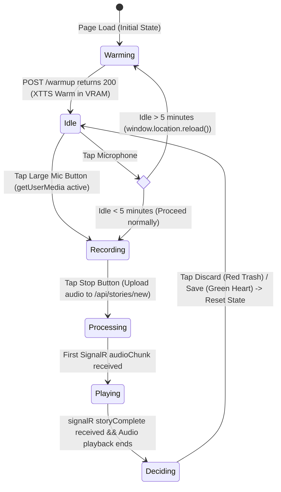

# Design: Magical Child-Friendly UI & Warmup/Inactivity State Machine

This document details the frontend state machine, inline SVG structures, CSS modules architecture, and JavaScript lifecycle handlers implementing the magical child-friendly UI, blocking warmup portal, and auto-reload inactivity guard.

## State Machine Diagram



## User Interface Elements

### 1. The Magic Book & Layout
* **Aspect Ratio Locking:** Locked strictly to `7:5` (`aspect-ratio: 7 / 5`) inside `.app-container`. Responsive to viewport width/height dynamically.
* **Vector Magic Book:** A hand-crafted, complex inline `<svg>` representing an open vintage leather book with gold filigree decorations, parchment pages, a red bookmark ribbon, and dynamic shadows.
* **Interactive Overlay:** Houses the responsive 3D buttons (offset box-shadow transitions on active tap states).

### 2. The Blocking Warmup Overlay
* **Visual Theme:** A dark-fantasy dark purple and violet radial gradient overlay (`.warmup-overlay`) covering the book wrapper.
* **Inline SVG Portal:** A rotating golden outer seal of stars (`.portal-ring`), an inner dash-array ring (`.portal-ring-inner`), and a pulsing central magical crystal ball (`.magic-orb`) glowing with pink and purple gradients.
* **Float Sparkles:** Dynamic particles (`.warmup-sparkle`) rising upwards with randomized delay, size, and duration.
* **Zero Text:** No letters or words are used on the loading screen, preserving accessibility for pre-literate children.

### 3. Decisions Buttons & Animations
* **Green Heart (Save):** Slides in from the left page with a heartbeat scaling animation. Tapping it makes a POST call to `/api/stories/{jobId}/save`, triggering a high-performance particle explosion of floating hearts (`.confetti-heart`) before fading back to idle.
* **Red Trash (Discard):** Slides in from the right page with a playful wiggle animation. Tapping it wiggles out and resets the page state to idle instantly.
* **Wait Star:** A golden five-pointed star SVG (`.btn-wait`) that pulses and spins clockwise to entertain the child during Ollama LLM story generation.
* **Play Note:** A joyful green note button that wiggles while floating notes (`🎵`, `🎶`) drift out of the book crease.

## JavaScript Lifecycle & Event Handling

### 1. Web Socket & Warmup Lifecycle (`init`)
1. Connects to the ASP.NET Core SignalR hub `/storyHub` using MsgPack serialization.
2. Upon successful hub connection, prints a console log and fires a blocking HTTP POST request to `/api/stories/warmup`.
3. Blocks user inputs and keeps the `.warmup-overlay` visible in `'warming'` state.
4. Transitions `state = 'idle'` and initializes `lastActivityTime = Date.now()` once the warmup endpoint returns a successful `200 OK`.

### 2. Inactivity Tracking
* Added event listeners to the `window` context to track active interactions:
  ```javascript
  const updateActivity = () => {
      this.lastActivityTime = Date.now();
  };
  ['click', 'touchstart', 'mousemove', 'keydown'].forEach(evt => {
      window.addEventListener(evt, updateActivity, { passive: true });
  });
  ```
* Every touch, click, cursor movement, or keypress updates `lastActivityTime` silently.

### 3. Inactivity Guard (F5 reload)
* At the beginning of `toggleRecording()`, the system calculates the time elapsed since the last recorded user interaction:
  ```javascript
  if (Date.now() - this.lastActivityTime > 5 * 60 * 1000) {
      console.log("[INACTIVITY] Idle over 5m. Reloading to pre-warm XTTS VRAM...");
      window.location.reload();
      return;
  }
  ```
* Bouncing back to page load using `window.location.reload()` automatically engages the blocking warmup screen and loads weights into VRAM.
